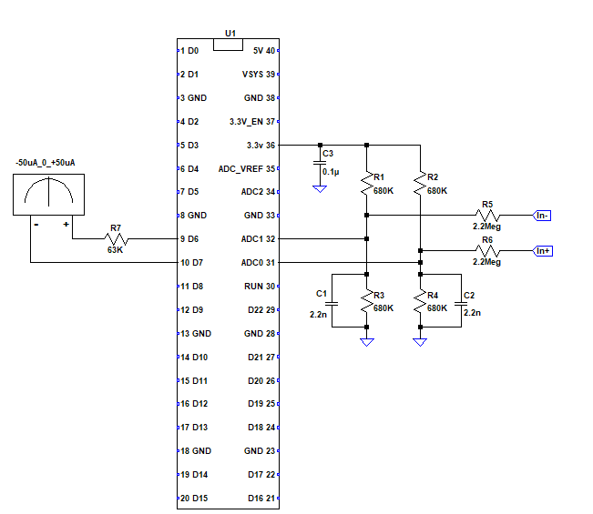

# Analog_Meter_PID

This project converts an inexpensive analog ammeter to a plus an minus 10V scale.
Linearity is improved to less than 1%. PID control using simulation
in the loop reduces overshoot and response time. Read the file:

"improving analog meter performance.pdf"

